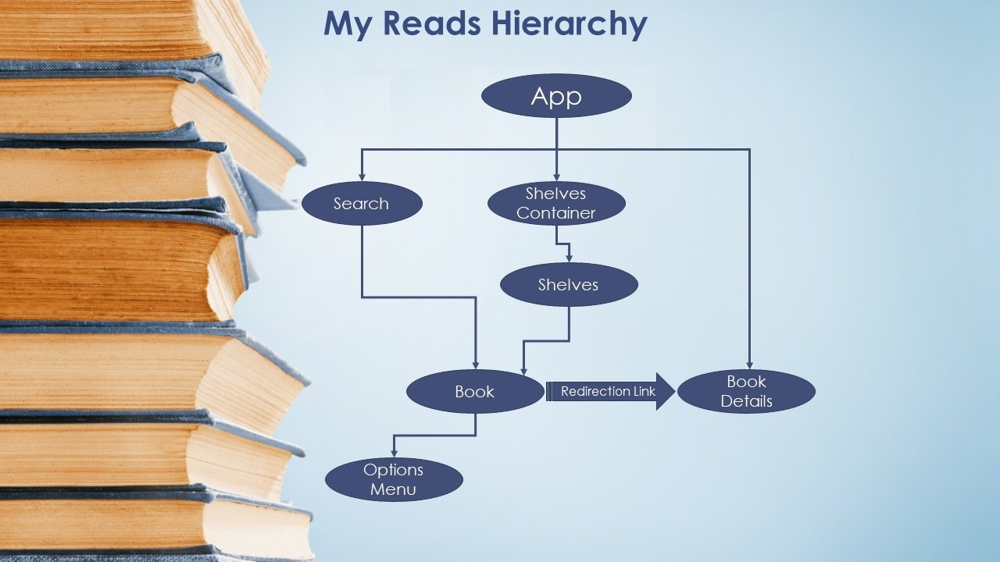
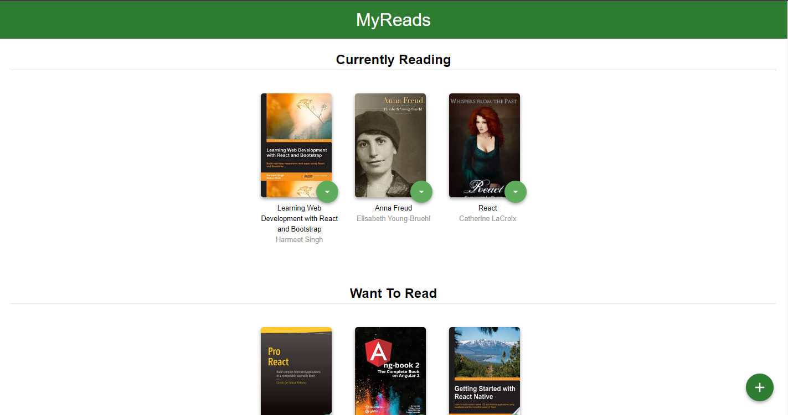

# MyReads Project

## This Project is for [React](https://reactjs.org/) NanoDegree Provided by [Udacity](https://www.udacity.com/) Sponsored by [EGFWD](https://egfwd.com/)
---
## Hierarchy

## Preview

---
## Technologies used
    ReactJS
    React-Router-Dom
---
## Project Details
    -Home Page
        - books can be stored in various shelves.
        - every book can move from shelf to another.
        - every book can be removed from it's own shelf.
    - Search Page
        - user can search for desired book by typing relative string to the book name in the search input.
        - user can add any book form search result to desired shelf

## Installation 
    - Clone the Repository then run `npm install` 
    - after the installation finishes type `npm start` then the development server will automatically open the App in the browser 
    - to build the app run `npm run build`